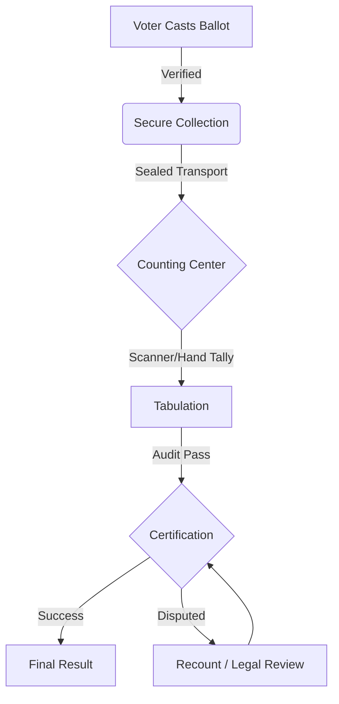

# VoteWise 🗳️
### How Votes Are Counted: An Interactive Election Explainer

This is a premium, interactive web application designed to demystify the mechanics of democracy. From the moment a ballot is cast to the final certification of results, this guide walks users through the lifecycle of a vote and the mathematical models used to determine winners.

**Live Demo:** [https://prompt-wars-445337920922.us-central1.run.app](https://prompt-wars-445337920922.us-central1.run.app)

---

## 🌟 Key Features

### 1. The Election Pipeline
A step-by-step visual breakdown of the five critical stages of an election:
- **Ballot Casting**: Verification and acceptance.
- **Collection**: Secure transport and chain-of-custody.
- **Counting**: Machine and hand-tallying protocols.
- **Tabulation**: Aggregating and reconciling data.
- **Certification**: Audits and legal finalization.

### 2. Interactive Ballot Casting
Experience the journey of a single vote. Users can select a candidate and watch their ballot go through security sealing, transport, and counting in real-time.

### 3. Voting Systems Simulations
Interactive simulations of common counting methods:
- **First-Past-The-Post (FPTP)**: The simplest "most votes win" model.
- **Ranked Choice Voting (RCV)**: An animated demonstration of elimination rounds and vote redistribution.
- **Proportional Representation (PR)**: Visualizing how seat shares reflect the popular vote in a multi-party system.

### 4. "Same Votes, Different Outcomes" Tool
A side-by-side comparison engine that allows users to adjust voter preferences via sliders and instantly see how different systems produce different winners from the exact same data.

---

## 📊 The Election Journey



---

## 🛠️ Technical Architecture

- **Frontend**: Vanilla HTML5, CSS3 (Glassmorphism & Particle Animations), and JavaScript.
- **Visuals**: HTML5 Canvas for real-time particle effects and bar chart animations.
- **Infrastructure**:
    - **Containerization**: Docker (Nginx Alpine).
    - **Environment Management**: Official Nginx Template system for dynamic port injection.
    - **Hosting**: Google Cloud Run (Serverless).
    - **Deployment**: Google Cloud Build.

---

## 🚀 Deployment

The project is configured for automated deployment to **Google Cloud Run**. 

**Deployment Command:**
```powershell
& "C:\Users\sushi\AppData\Local\Google\Cloud SDK\google-cloud-sdk\bin\gcloud.cmd" run deploy prompt-wars --source . --region us-central1 --allow-unauthenticated
```

**Infrastructure Note:** The `Dockerfile` is optimized to listen on the dynamic `$PORT` variable provided by Cloud Run using Nginx's template engine (`/etc/nginx/templates/default.conf.template`).
